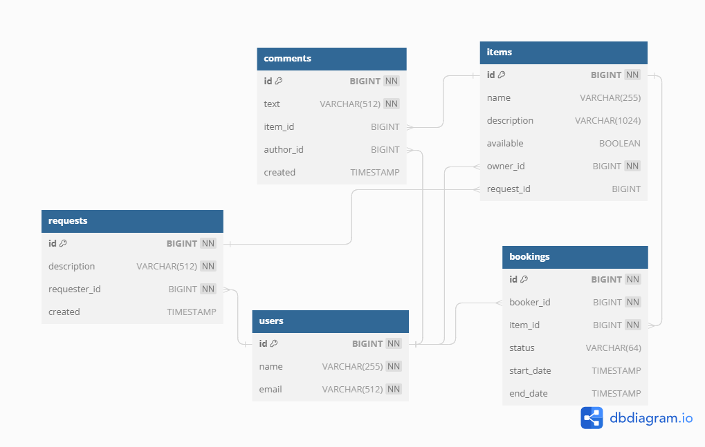

java-shareit

### Приложение для обмена вещами.

Сервис позволяет пользователям искать вещи по текстовому запросу, просматривать список вещей, доступных для аренды, бронировать выбранную вещь на определенные даты. Также реализована возможность создавать запрос на вещь, если пользователь не нашел то, что искал. Другие пользователи могут просматривать запросы и добавлять новые вещи. Кроме того, реализована возможность оставления комментариев к вещам, но только если пользователь уже арендовал вещь.

### Технологический стек:

    Java 11
    Spring Boot
    Maven
    Lombok
    PostgreSQL
    H2
    Docker
    Hibernate
    Mockito
    JUnit

#### Функционал: Для всех сущностей (пользователи, вещи, запросы на аренду, запросы на добавление вещей, комментарии) доступны:

* добавление
* обновление
* просмотр
* удаление

### ER-диаграмма

